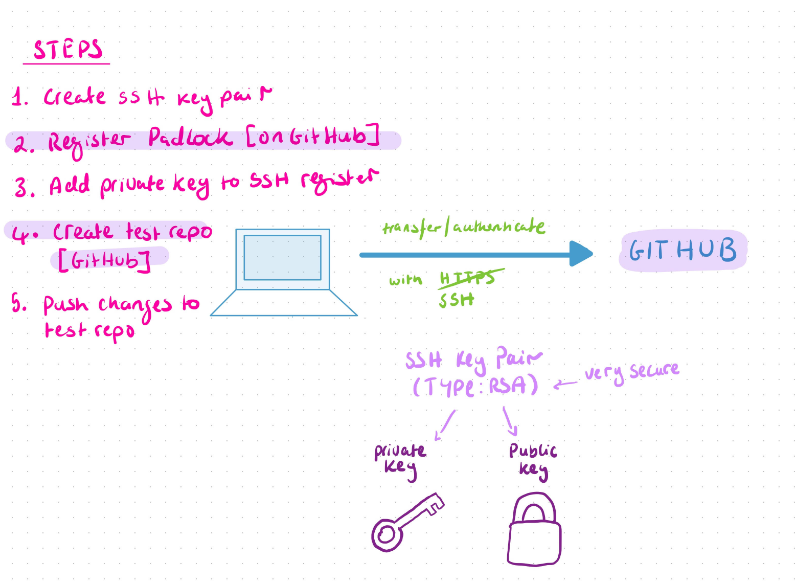
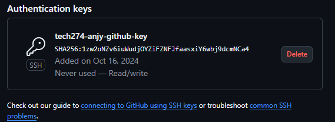
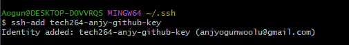
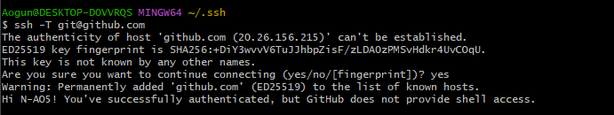

# Using SSH to push git repos



### 1. Create SSH key pair

1. cd into your .shh folder
2. use ```ssh-keygen -t rsa -b 4096 -C "your email address"```
3. name it - "tech264-anjy-github-key"
4. enter to skip pass code - skip confirm too

### 2. Register padlock (on github)

1. login into github
2. go to settings on the side menu
3. go to SSH and GPG keys
4. click new SSH key
5. name it - "tech274-anjy-github-key"
6. leave key type as authentication key 
7. in bash ```cat tech264-anjy-github-key.pub``` - make sure it's your PUBLIC KEY
8. copy the key exactly and paste in github where it says "key"
9. create


### 3. Add private key to SSH register

1. go back to the bash window 
2. we need to start an "ssh agent" - ``` eval `ssh-agent -s` ```
3. bash window will give you a process ID (PID)
4. we need to register our private key with this ssh agent ``` ssh-add *your key name*``` 
 
5. test using this ```ssh -T git@github.com``` - when key is registered, you can be anywhere in your machine
 

### 4. Create a Test Repo

1. Create new repo on git hub
2. name it "Tech264-test-ssh"
3. make it public
4. change the quick setup to SSH
5. create a repo in you bash window with the same name as your gihub repo
6. create a readme, initialize your git repo, make your first commit 
7. change the branch name - ```git branch -M main```
8. use the gig remote add -``` git remote add origin git@github.com:N-AO5/Tech264-test-ssh.git```

# Use cloning

1. create the repo on github
2. when in the repo click the green "<> code" drop down and copy the SSH command 
3. then paste into the appropriate repo on you bash window ```git clone git@github.com:N-AO5/Tech264-test-ssh.git ```

# To change a repo from HTTPS to SSH  

1. ```git remote -v``` will tell you the current remote URL
2.  ```git remote set-url origin git@github.com:N-AO5/tech264-cloud-linux.git``` to change your remote URL to SSH
3.  Run the git remote -v command again and it should've changed
4.  you should be able to commit and push